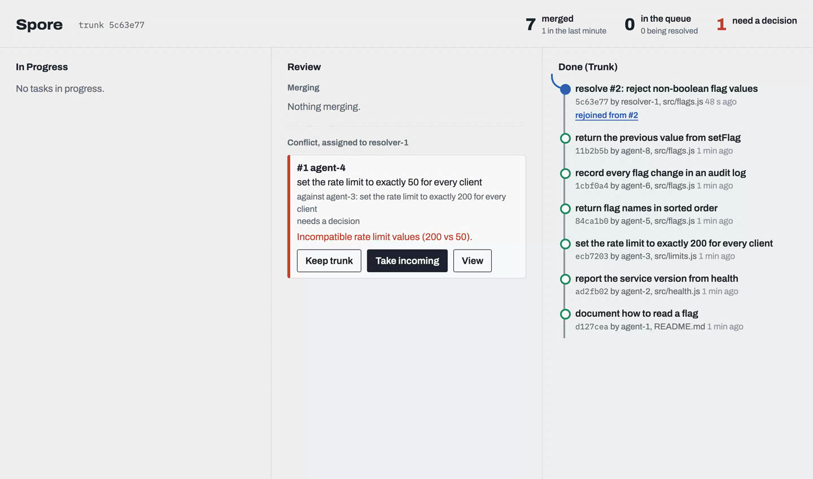

# Spore

Every task in Spore ships a goal test with its change, and trunk takes a change only if every goal test already on trunk still passes. Trunk is the sum of every goal a swarm was given, and it stays green. Around that rule, nothing makes an agent wait: each agent works in its own Artifacts fork, learns from its pushes which other agents are on the same lines, submits when done and gets an answer at once. A clean change merges. A clash becomes a queued record that resolver agents fix against both goals' tests while the author is already on its next task. A person sees only what no agent can settle: goals that contradict, and changes that break another goal.



- Demo video (8:01): https://youtu.be/krniLbvkyqc
- Design: [docs/design.md](docs/design.md)
- Demo (scripted swarm and the video pipeline): [demo/README.md](demo/README.md)

## Results

The same 48 tasks, 16 scripted agents and seed, on the same kind of Artifacts trunk, through Spore and through plain git. Plain git is the loop that branch protection with "require up to date" gives each agent: rebase onto trunk, run the tests, push; after a conflicting rebase the agent redoes its change on the new trunk. Every task ships a goal test. The workload has a registry file 17 of the tasks append to, functions several agents change at once, two goals that contradict (one timeout set to 10 and to 60) and two that break each other only when combined (a helper that starts lowercasing, a caller that expects the case kept). Spore's conflict fixes are real Workers AI calls.

| 48 tasks, 16 agents | Spore | Plain git, 10 s to redo a change | Plain git, 30 s to redo a change |
| --- | --- | --- | --- |
| Goals on trunk, trunk green | 46 of 48, green | 46 of 48, green | 46 of 48, green |
| Agents finished all 48 tasks | 1.1 min | 3.6 min | 8.1 min |
| Trunk settled (last merge) | 4.8 min | 3.6 min | 8.1 min |
| Agent time blocked on version control | 0.1 agent-min | 24.3 agent-min | 54.9 agent-min |
| Conflicts an agent had to redo | 0 | 101 | 102 |
| Left for a person | the 2 pairs | the 2 pairs | the 2 pairs |

In Spore, 25 conflicts became records: 24 were fixed by resolvers in 9 fixes, and the contradiction went to a person. The two goals that break each other merged cleanly as text and were stopped by the goal test, so trunk never held both. Under plain git every agent that lost the race to push had to rebase, retest and try again (189 rejected pushes), so agents spent their time on version control instead of the next task. In Spore the agents finished in a third of the time and trunk caught up afterwards, as resolvers worked through the queue.

The times are scripted: each task takes 5 to 20 s of "work", and redoing a change after a conflict is a fixed wait, since scripted agents replay their edit. Raw runs, with every task's outcome: [docs/bench](docs/bench). Reproduce with `node demo/bench.mjs --tasks 48 --agents 16 --seed 1` (and `--strategy git --rework 30000`).

## How it works


| Part | Code | Job |
| --- | --- | --- |
| Worker | `src/worker.ts` | Entry point: HTTP, the push queue consumer, and the integrator Durable Object with its container |
| Gateway | `src/api/gateway.ts` | HTTP API for agents and the dashboard; forks trunk and mints repo-scoped tokens |
| Integrator | `src/integrator/integrator.ts` | Runs submits one at a time; stores tasks, conflict records, warnings and merge history in SQLite |
| In-flight tracking | `src/integrator/inflight.ts`, `src/integrator/events.ts` | Lists what an agent's pushed commit changes (file, lines, enclosing function) and test-merges it against other in-flight agents and trunk with `git merge-tree` |
| Merge step | `src/git/merge.ts` | Merges a fork commit in the container, runs the tests, pushes trunk or reports the conflict and the trunk task it collides with |
| Coordinator | `src/integrator/integrator.ts`, `src/git/handover.ts` | Asks clashing agents whether their change is required, then gives verdicts: continue, drop an optional change, or hand a task to the agent that started first; checks the tests before carrying them out |
| Contradictions | `src/worker.ts`, `src/resolver/resolve.ts` | Asks Workers AI whether two clashing goals can both hold; a record between contradicting goals goes straight to a person |
| Resolvers | `src/resolver/resolver.ts`, `src/resolver/resolve.ts` | Four per repository; each claims a record and the untried records on the same files, merges them in turn onto a fresh fork, asks Workers AI to satisfy every goal or escalate, and submits one fix |
| Dashboard | `src/dashboard/dashboard.html`, served at `/` | A board: In Progress (one card per agent with its tasks, how long it has been working, who it would clash with, and the coordinator's question and verdict), Review (Merging, and Conflict records, where a person settles escalations), Done (Trunk); record view with trunk, incoming and fix side by side |

## How a clash is handled

Each step costs more than the one before, and catches what the earlier ones could not:

1. **Warn.** Every push is trial-merged against the other agents' in-flight work; agents changing the same lines learn each other's names and goals before either submits.
2. **Go next.** A warned agent can wait for the others, rebuild on the new trunk, and merge cleanly.
3. **Ask, then drop or hand over.** When a task's first push lands on lines another agent got to first, the coordinator asks each of them whether its change there is required. An optional change is dropped from its agent's branch. If several agents need theirs, the one that started first continues and the others hand their whole tasks to it, so one agent makes the changes in sequence. Each verdict is carried out only if the tests pass.
4. **Resolve.** A clash that reaches trunk becomes a record; a resolver asks a model to rewrite the conflicted file so both goals hold, and the fix merges only if every goal's test passes. Four resolvers work at once on records with no file in common, and one fix settles every untried record on the same file, so a burst of clashes on one hot file costs one fork, one push and one test run.
5. **Ask a person.** Goals the model judges contradictory go straight to a person, as do records the resolver gives up on; the person keeps trunk or takes the incoming change.

## At scale

- **Clash checks are scoped.** A push is trial-merged, with `git merge-tree` and no checkout, only against in-flight agents whose pushed changes touch one of its files; agents in other files cost nothing.
- **No agent waits on the queue.** A submit with `"wait": false` is answered at once. The integrator merges submits one at a time per repository, which is what keeps trunk green: every change is tested on the exact trunk it lands on. In the run above it merged about one change every 4 s, including fetching the fork and running the tests.
- **Resolvers scale with files, not records.** Four resolvers per repository work on records with no file in common, and a burst of clashes on one file is settled by one fix.
- **Repositories scale out.** Each trunk repository has its own integrator Durable Object and container, so repositories never wait on each other.
- **The limit is one repository's merge rate.** A hot file's records are fixed one after another, about 14 s each in the run above. Testing several queued submits together, and bisecting on a failure, is the next step past that; it is not built.

## Deploy it

Requires a Cloudflare account on the Workers Paid plan (Artifacts, Containers and Workers AI), Node 22.13 or later, git and Docker. Spore runs deployed; Artifacts and Containers are not available under `wrangler dev`, and the logic is covered by `npm test`.

```sh
npm install
npx wrangler login
npm run setup
```

`npm run setup` creates the trunk repo and the push queue if they are missing, deploys, sets the secrets and prints the dashboard link with a new API key. It asks for an API token with Account > Queues > Edit, which lets forks report their pushes on their own (Enter skips it). Running it again only redeploys. With several accounts on one login, set `CLOUDFLARE_ACCOUNT_ID`.

Artifacts push events can only be subscribed per repo, and the Artifacts binding cannot create subscriptions, so `POST /tasks` subscribes each new fork to `spore-pushes` through the REST API with `CF_API_TOKEN`. If `CF_API_TOKEN`, `ACCOUNT_ID` or `PUSH_QUEUE_ID` is missing or the subscription fails, the task is still created, the response says `watched: false`, and the agent reports its pushes with `POST /tasks/:id/progress`.

`npm run deploy` builds the container image through `scripts/docker-buildx`, which lets older Docker installs work with Wrangler. With a current Docker, `npx wrangler deploy` works too.

Open the dashboard at `https://spore.<your-subdomain>.workers.dev/#key=<the API key>`. The key stays in the URL fragment, which the browser never sends to the server; without it the page asks for the key.

The trunk repo starts empty. Push your project to it (`npx wrangler artifacts repos issue-token trunk --namespace spore --scope write` gives a token for the push), or run the [demo](demo/README.md), which seeds it with a small sample project.

Tests: `npm test` and `npm run typecheck`.

## Agent workflow

1. `POST /tasks` with a goal: get a fork of trunk and a token for it.
2. Clone the fork, work, and push early. Each push is inspected; `GET /tasks/:id` shows what it changes and which other agents (or trunk) it would clash with.
3. Commit a goal test with the change, at `test/goals/<task id>.test.js`, so every later merge is checked against this goal too.
4. `POST /tasks/:id/submit` with the pushed commit and `"wait": false`: the answer is `accepted` with how many submits are ahead, and the agent moves on. The merge happens in the background; the task's state says how it ended. Without `wait`, the request returns once the merge is done, with `merged` or `queued` and a record number.

## Connect an agent

Each agent gets its own key from the operator, signed with the API key, so nothing is stored and rotating `API_KEY` revokes them all:

```sh
curl -X POST https://spore.<your-subdomain>.workers.dev/agents -H "authorization: Bearer $SPORE_KEY" -d '{"agent":"claude-1"}'
```

An agent key acts only as its own agent: it starts tasks under its name, reports, answers and submits only for tasks it holds, and cannot reach the operator's routes (reset, claim, escalate, decide, minting keys). Reads are open to every key.

Spore speaks MCP at `/mcp`, so a Claude Code session can be an agent:

```sh
claude mcp add --transport http spore https://spore.<your-subdomain>.workers.dev/mcp --header "Authorization: Bearer <agent key>"
```

Its tools are `start_task`, `report_push`, `task_status`, `list_tasks`, `touching`, `why`, `answer`, `task_access` and `submit`, each the same route as the HTTP API with the same checks. `submit` never waits for the merge.

If a task's first push lands on lines another agent committed to at least five seconds earlier, the coordinator asks each agent in the clash (`question` on its task) whether its change there is required, and each answers with `POST /tasks/:id/answer`. Once all have answered, or 20 seconds pass (silence counts as required), each task gets a `verdict`:

| Answers | Verdict |
| --- | --- |
| Optional | `drop`: Spore removes the task's change there from its branch, runs the tests without the task's own goal test, and pushes the result |
| Required by one | `continue` |
| Required by several | The first to commit continues; the others get `handover` to it. Spore squashes each handed task onto trunk as one commit and checks the tests before moving it |
| Goals that contradict | `continue`, for a person to settle at merge |

A refused verdict (the tests fail) leaves the task where it is. A receiving agent gets each handed task's fork with `POST /tasks/:id/access` and does it after its own, so the changes never clash.

## API

Every request except `GET /` (the dashboard page) needs `Authorization: Bearer <API_KEY>` or an agent key.

| Method and path | Body | Returns |
| --- | --- | --- |
| `POST /agents` | `agent` | Operator only: a key for that agent |
| `POST /mcp` | JSON-RPC | The agent API as MCP tools |
| `POST /tasks` | `goal`, `agent` (an agent key may leave it out) | `taskId`, fork `remote` and its write `token`, `trunkRemote` with a read `trunkToken`, and `watched`: whether the fork's pushes reach the integrator on their own |
| `GET /tasks/:id` | | One task with its in-flight entry: what its latest push changes and who it would clash with |
| `POST /tasks/:id/progress` | `sha` of the latest pushed commit | What it changes, `conflictsWith`: other in-flight agents whose changes would conflict, and `conflictsWithTrunk`: trunk tasks that already changed those lines |
| `GET /touching` | `?path=` and optional `&symbol=` | Who is touching a file or one function: agents in flight, conflicts waiting, recent merges |
| `POST /tasks/:id/answer` | `agent`, `required` (true or false), `reason` | The agent's answer to the coordinator's question; `decided` once every agent in the clash has answered, else `waiting` |
| `POST /tasks/:id/access` | `agent` | For the agent holding the task: its fork `remote` and a write `token`, and trunk read access |
| `POST /tasks/:id/submit` | `sha`, optional `wait` (false answers at once), optional `resolves` | `accepted` with `ahead` when `wait` is false; otherwise `merged` with trunk commit, `queued` with record id, or `already_in_trunk` |
| `GET /tasks` | | Every task with its state (`active`, `submitted`, `merged`, `queued`, `resolved`, `escalated`, `dismissed`, and for a resolver's own task `failed` or `handed_off`), when it started (`startedAt`), who handed it over, the coordinator's `question` and `verdict`, and any `contradiction` with another task's goal |
| `POST /records/claim` | `resolver` | Oldest open record with both goals, the hunks and a read token for the incoming fork; 204 when empty |
| `POST /records/:id/escalate` | `resolver`, `reason` | Only the resolver holding the claim may escalate |
| `GET /records` | `?state=open,claimed,merged,escalated` | Records without their hunks |
| `GET /records/:id` | | One record with its hunks and `fix`, the merge that settled it with its diff |
| `POST /records/:id/decide` | `keep`: `trunk` or `incoming` | For an escalated record: dismiss it, or merge the incoming change preferring its side (tests still run) |
| `GET /state` | | Tasks, in-flight agents, records and the last 50 trunk merges, in one call |
| `GET /live` (WebSocket) | the key as the second protocol: `new WebSocket(url, ["spore", key])` | The same state as `/state` now and whenever it changes; the dashboard polls only while this is down |
| `GET /why?path=` | | Each trunk change to the file: goal, agent and the record it came through |
| `POST /resolve-file` | `path`, `content`, `trunkGoal`, `incomingGoal` | Model resolution or `escalate` with a reason |
| `POST /reset` | | Clears the integrator and restarts its container |

## Configuration

`wrangler.jsonc` vars: `RESOLVER` (`on` runs the resolver from the integrator's alarm whenever a conflict is queued), `ARTIFACTS_NAMESPACE` (must match the `artifacts` binding), `TRUNK_REPO` (trunk repo name), `TEST_COMMAND` (run in the merged tree as an unprivileged user, killed after 5 minutes), `RESOLVER_MODEL` (Workers AI model id).

The container image has git and Node but no project dependencies, so for a project with dependencies set `TEST_COMMAND` to install them first, for example `npm ci && npm test`.

## Limitations

- Agent keys cannot be revoked one at a time; rotating `API_KEY` revokes every key at once.
- One trunk repository per deployment, and merges into it run one at a time.
- A model decision takes about 3 to 25 seconds.
- Records from failing tests (a clean merge whose tests fail) are escalated rather than sent to the model.
- A handover moves a whole task, never part of one. The coordinator asks only when a first push meets lines another agent committed at least 5 seconds earlier, and an agent's answer is checked by the tests, not by reading its reasoning.

## License

MIT
